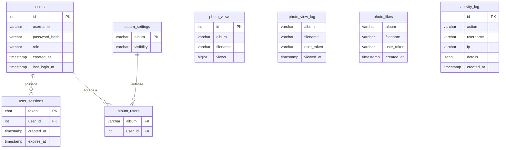

# Photo Book

A self-hosted photo gallery with support for 360° panoramic photos, GPS map, view counts and likes — deployable on any Linux VPS with a single script.

---

## Introduction

Photo Book is a lightweight personal photo gallery designed to be run on a private server. Drop your photos into album folders and the app takes care of the rest: it reads EXIF metadata, generates low-resolution previews, detects 360° panoramas and displays them in an immersive viewer, and plots GPS-tagged photos on an interactive map.

Key features:

- **Album browser** — photos are organised into sub-directories; the app scans them automatically on startup
- **360° viewer** — equirectangular panoramas (detected via EXIF `ProjectionType` or a 2:1 aspect ratio) are rendered with Pannellum
- **Interactive map** — all GPS-tagged photos are plotted across albums; clicking a marker opens the photo
- **View counts & likes** — tracked per user session (anonymous UUID) and persisted in PostgreSQL
- **Reverse geocoding** — GPS coordinates are resolved to human-readable place names via Nominatim (OpenStreetMap), cached in memory
- **Preview generation** — sharp generates JPEG previews on first access and caches them to disk; subsequent server restarts are near-instant
- **Internationalisation** — the interface is available in French, English and Spanish; the language is auto-detected from the browser and can be switched at any time via a dropdown in the header

Role-based access control — albums can be public or restricted to selected users. No cloud dependency, no tracking.

---

## Architecture

```
Browser
  │
  │  HTTPS (443)
  ▼
┌─────────────────────────────────────────────────┐
│  Traefik  (reverse proxy + TLS)                 │
│  • HTTP → HTTPS redirect                        │
│  • Let's Encrypt certificate (ACME)             │
│  • HSTS header                                  │
│  • Routes *.domain → photo-book:3000            │
└────────────────────┬────────────────────────────┘
                     │  HTTP (internal network)
                     ▼
┌────────────────────────────────────────────────┐
│  photo-book  (Node.js / Express)               │
│                                                │
│  POST /api/auth/login      authenticate        │
│  POST /api/auth/logout     invalidate session  │
│  GET  /api/auth/me         current user        │
│  GET  /api/albums          album list          │
│  GET  /api/albums/:name    photos + metadata   │
│  GET  /api/map             all GPS photos      │
│  GET  /api/geocode         reverse geocoding   │
│  POST /api/view            record a view       │
│  POST /api/like            toggle a like       │
│  GET  /api/liked           liked filenames     │
│  DELETE /api/albums/:a/photos/:f  delete photo │
│  /api/admin/*              admin panel API     │
│                                                │
│  Static: public/  (HTML, CSS, JS)              │
│  Static: /photos  (original images)            │
│  Static: /previews (generated thumbnails)      │
└───────────┬──────────────────┬─────────────────┘
            │  SQL (pg)        │  filesystem
            ▼                  ▼
┌─────────────────┐   ┌──────────────────────────┐
│   PostgreSQL    │   │  Volumes                 │
│                 │   │  ./photos/               │
│  photo_views    │   │    └── Album Name/       │
│  photo_view_log │   │         └── img.jpg      │
│  photo_likes    │   │  ./public/previews/      │
│  users          │   │    └── Album Name/       │
│  user_sessions  │   │         └── img.jpg      │
│  album_settings │   └──────────────────────────┘
│  album_users    │
└─────────────────┘
```

### Containers

| Container | Image | Role |
|---|---|---|
| `traefik` | `traefik:v3.3` | Reverse proxy, TLS termination, HTTP→HTTPS redirect, HSTS |
| `photo-book` | `jarod68/photo-book:latest` | Node.js application server |
| `postgres` | `postgres:16-alpine` | Persistent storage (views, likes, users, sessions, album settings) |
| `adminer` | `adminer:latest` | Optional database UI, exposed via Traefik |

All three containers share a `proxy` bridge network. Traefik and photo-book communicate over this network; the Docker socket is not mounted (routing is configured via a static file provider).

### Configuration files

| File | Versioned | Description |
|---|---|---|
| `docker-compose.yml` | ✓ | Full stack definition with `${VAR}` references |
| `traefik/static.yml` | ✓ | Traefik entrypoints, ACME, file provider |
| `traefik/dynamic.yml` | generated | Router rule (domain), service URL, middlewares |
| `.env` | generated | Secrets and server-specific values |
| `letsencrypt/acme.json` | generated | TLS certificate store (chmod 600) |

`deploy.sh` generates the three files marked *generated*; everything else lives in the repository.

The database schema is managed entirely by `services/database.js`, which runs `CREATE TABLE IF NOT EXISTS` on every startup. There is no external SQL init file — this ensures schema consistency across fresh installs, container restarts, and upgrades.

### Preview pipeline

On first access to an album, `ensurePreview` is called for each photo:

```
Original JPEG/PNG/WEBP
  └─► sharp.rotate()           ← apply EXIF orientation
      .resize(1024 or 1536)    ← 1536 px for 360° photos
      .jpeg({ quality: 76 })
      .toFile(public/previews/AlbumName/photo.jpg)
```

Previews are served as static files by Express and persist across container restarts via a bind-mounted volume.

---

## Authentication & access control

### How sessions work

Authentication is cookie-based. On a successful `POST /api/auth/login`, the server generates a 64-character hex token (`crypto.randomBytes(32).toString('hex')`), stores it in the `user_sessions` table with a 30-day expiry, and sets an `HttpOnly`, `SameSite=Strict` cookie named `pb_session`.

Every protected request reads that cookie and verifies the token against the database. There are no JWTs, no refresh tokens — just a server-side session that can be invalidated instantly via logout or by deleting the row.

```
POST /api/auth/login  { username, password }
  │
  ├─ bcrypt.compare(password, stored_hash)
  │
  └─ INSERT INTO user_sessions (token, user_id, expires_at)
     SET-COOKIE pb_session=<64-hex>; HttpOnly; SameSite=Strict
```

The `admin` account is created automatically on first startup with a randomly generated password (`word-word##` format). The password is printed once to the container logs and can be changed via the admin panel.

---

### Roles & permissions

There are three access levels. A user has exactly one role stored in the `users` table.

#### Anonymous — no session

Visits the site without logging in. Can browse and interact with all **public** content.

- View the album grid and open any public album
- Browse the global GPS map (public albums only)
- Record views and toggle likes (tracked by an anonymous UUID stored in `localStorage`)
- Restricted albums are invisible — they do not appear in lists and return `401` if accessed directly

#### Basic — authenticated, `role = 'basic'`

A named user who has been granted access to specific restricted albums by an admin.

- Everything an anonymous visitor can do
- Sees restricted albums they have been explicitly authorized for (via `album_users`)
- Can delete photos from albums they have access to (`canDelete = true`)
- Cannot access the admin panel or any `/api/admin/*` route

#### Admin — authenticated, `role = 'admin'`

Full control over the application.

- Everything a basic user can do, across **all** albums regardless of visibility
- Access to the admin panel (`/admin.html`)
- Create, rename, and delete albums
- Upload and delete photos
- Manage users (create, change role, change password, delete) — except the built-in `admin` account cannot be deleted or have its role changed
- Configure per-album visibility (`public` / `restricted`) and the list of authorized users

---

### RBAC route matrix

`✓` = access granted · `401` = not authenticated · `403` = authenticated but insufficient role

#### Public routes — no authentication required

| Route | Anonymous | Basic | Admin | Notes |
|---|---|---|---|---|
| `POST /api/auth/login` | ✓ | ✓ | ✓ | |
| `POST /api/auth/logout` | ✓ | ✓ | ✓ | no-op if no session |
| `GET /api/auth/me` | ✓ `null` | ✓ user | ✓ user | returns `{ user: null }` when not logged in |
| `POST /api/view` | ✓ | ✓ | ✓ | deduplicated by anonymous token |
| `POST /api/like` | ✓ | ✓ | ✓ | toggle, deduplicated by anonymous token |
| `GET /api/liked` | ✓ | ✓ | ✓ | |
| `GET /api/geocode` | ✓ | ✓ | ✓ | |

#### Visibility-filtered routes

Content varies depending on the authenticated user. Anonymous visitors and basic users without authorization only see public albums.

| Route | Anonymous | Basic | Admin |
|---|---|---|---|
| `GET /photos/*` (public album) | ✓ | ✓ | ✓ |
| `GET /photos/*` (restricted album) | `401` | ✓ if authorized | ✓ |
| `GET /previews/*`, `GET /medium/*` | same as `/photos/*` | same | ✓ |
| `GET /api/albums` | public only | public + authorized restricted | all |
| `GET /api/albums/:album` (public) | ✓ | ✓ | ✓ |
| `GET /api/albums/:album` (restricted) | `401` | ✓ if authorized | ✓ |
| `GET /api/map` | public albums | + authorized restricted | all |

`canDelete` (returned by `/api/albums` and `/api/albums/:album`) is `true` for admins and for basic users authorized on that album. It controls whether the delete button appears in the viewer.

#### User route — requires authentication

| Route | Anonymous | Basic | Admin | Notes |
|---|---|---|---|---|
| `DELETE /api/albums/:album/photos/:filename` | `401` | ✓ if `canDelete` | ✓ | `403` if `canDelete = false` |

#### Admin routes — requires `role = 'admin'`

All `/api/admin/*` routes first pass through `requireAuth` (→ `401` if no session), then `requireAdmin` (→ `403` if `role ≠ 'admin'`).

| Route | Anonymous | Basic | Admin |
|---|---|---|---|
| `GET /api/admin/stats` | `401` | `403` | ✓ |
| `GET /api/admin/system` | `401` | `403` | ✓ |
| `GET /api/admin/top-photos` | `401` | ✓ ⚠️ | ✓ |
| `POST /api/admin/albums` | `401` | `403` | ✓ |
| `PATCH /api/admin/albums/:album` | `401` | `403` | ✓ |
| `DELETE /api/admin/albums/:album` | `401` | `403` | ✓ |
| `POST /api/admin/albums/:album/photos` | `401` | `403` | ✓ |
| `DELETE /api/admin/albums/:album/photos/:filename` | `401` | `403` | ✓ |
| `GET /api/admin/albums/:album/settings` | `401` | `403` | ✓ |
| `PUT /api/admin/albums/:album/settings` | `401` | `403` | ✓ |
| `GET /api/admin/users` | `401` | `403` | ✓ |
| `POST /api/admin/users` | `401` | `403` | ✓ |
| `PATCH /api/admin/users/:id` | `401` | `403` | ✓ † |
| `DELETE /api/admin/users/:id` | `401` | `403` | ✓ † |

> ⚠️ `GET /api/admin/top-photos` only carries `requireAuth`, not `requireAdmin` — an authenticated basic user can access it.
>
> † The built-in `admin` account is protected: its role cannot be changed and it cannot be deleted (`403`).

---

## Implementation

### Backend

| Technology | Version | Role |
|---|---|---|
| Node.js | 22 (Alpine) | Runtime |
| Express | 4.x | HTTP server and routing |
| sharp | 0.34 | Image resizing and JPEG encoding |
| exifr | 7.x | EXIF/XMP/IPTC/GPS metadata extraction |
| pg | 8.x | PostgreSQL client |

The backend is written in CommonJS (`require`/`module.exports`) and runs as a single process. On startup it:

1. Connects to PostgreSQL with a retry loop (up to 10 attempts)
2. Syncs the filesystem to the database (inserts any new photo rows)
3. Pre-generates missing previews in the background

### Frontend

The frontend is vanilla JavaScript with ES modules — no bundler, no framework.

```
public/
├── index.html          home page (album grid)
├── viewer.html         photo viewer + 360° (Pannellum)
├── map.html            global GPS map (Leaflet)
├── login.html          login form
├── admin.html          admin panel (albums, users, system, top photos)
├── api/
│   └── client.js       fetch wrappers for all API endpoints
├── locales/
│   ├── fr.js           French translations
│   ├── en.js           English translations
│   └── es.js           Spanish translations
├── utils/
│   ├── auth-check.js   redirect to /login.html if not authenticated
│   ├── format.js       date/number formatting helpers
│   ├── i18n.js         internationalisation (t, getLang, setLang, applyTranslations)
│   ├── map-math.js     GPS clustering and route segmentation
│   └── user-token.js   anonymous UUID session management
├── pages/
│   ├── home.js         album listing page logic + auth controls
│   ├── viewer.js       photo viewer page logic
│   ├── map.js          map page logic
│   ├── login.js        login form submit + redirect
│   └── admin.js        admin panel: albums, users, system stats, upload
└── components/
    ├── album-card.js   album grid card
    ├── album-map.js    per-album mini map
    ├── album-tabs.js   tab navigation
    ├── map-marker.js   Leaflet custom marker
    ├── photo-map.js    full-screen map component
    ├── photo-viewer.js photo display + controls
    └── thumbnail-strip.js  horizontal thumbnail strip
```

External libraries loaded from CDN: **Pannellum** (360° viewer), **Leaflet** (maps).

### Internationalisation (i18n)

All UI strings are managed through a lightweight translation system in `public/utils/i18n.js`. There is no runtime dependency — locale files are plain ES modules that export flat key/value objects.

**Language detection order:**

1. `localStorage.getItem('lang')` — previously selected language
2. `navigator.language` — browser preference (first two characters)
3. Fallback to `'en'`

**Adding a translation key:**

1. Add the key to all three locale files (`fr.js`, `en.js`, `es.js`)
2. Use `t('my.key')` in JS, or `data-i18n="my.key"` on a static HTML element

```js
// JS usage
import { t } from '../utils/i18n.js';
el.textContent = t('album.photos', { n: 42, s: 's' });

// HTML usage (translated by applyTranslations() on page load)
<h2 data-i18n="admin.albums">Albums</h2>
<input data-i18n-placeholder="admin.albumName" placeholder="Album name">
<button data-i18n-aria="viewer.close">✕</button>
```

**Adding a new language:**

1. Create `public/locales/xx.js` mirroring the structure of `en.js`
2. Add `'xx'` to `SUPPORTED` and an entry to `LABELS` in `i18n.js`
3. Import the new locale file at the top of `i18n.js`

The language switcher dropdown is rendered automatically by `initLangSwitcher('lang-switcher')` — no HTML changes needed in the page templates.

### Database schema

```sql
-- View counting (deduplicated by user token)
CREATE TABLE photo_view_log (
  album       VARCHAR(255),
  filename    VARCHAR(255),
  user_token  UUID,
  PRIMARY KEY (album, filename, user_token)
);

CREATE TABLE photo_views (
  id        SERIAL PRIMARY KEY,
  album     VARCHAR(255) NOT NULL,
  filename  VARCHAR(255) NOT NULL,
  views     BIGINT NOT NULL DEFAULT 0,
  UNIQUE (album, filename)
);

-- Likes (toggleable, deduplicated by user token)
CREATE TABLE photo_likes (
  album       VARCHAR(255),
  filename    VARCHAR(255),
  user_token  UUID,
  PRIMARY KEY (album, filename, user_token)
);

-- Authentication
CREATE TABLE users (
  id            SERIAL PRIMARY KEY,
  username      VARCHAR(255) NOT NULL UNIQUE,
  password_hash VARCHAR(255) NOT NULL,
  role          VARCHAR(50)  NOT NULL DEFAULT 'basic'
);

CREATE TABLE user_sessions (
  token      CHAR(64)    PRIMARY KEY,
  user_id    INTEGER     NOT NULL REFERENCES users(id) ON DELETE CASCADE,
  created_at TIMESTAMPTZ NOT NULL DEFAULT NOW(),
  expires_at TIMESTAMPTZ NOT NULL
);

-- Per-album access control
CREATE TABLE album_settings (
  album       VARCHAR(255) PRIMARY KEY,
  visibility  VARCHAR(50)  NOT NULL DEFAULT 'public'
);

CREATE TABLE album_users (
  album   VARCHAR(255) NOT NULL,
  user_id INTEGER      NOT NULL REFERENCES users(id) ON DELETE CASCADE,
  PRIMARY KEY (album, user_id)
);
```

Views are deduplicated: a user token can only increment the counter once per photo. Likes are toggleable. The schema is managed entirely in `services/database.js` via `CREATE TABLE IF NOT EXISTS` on every startup — there is no external SQL init file.

#### Diagramme Merise (MCD)



---

## Tests unitaires

The test suite uses **Vitest 2.x** with V8 coverage.

```
tests/
├── client/
│   ├── api-client.test.js    API client fetch wrappers
│   ├── format.test.js        date/number formatters
│   ├── map-math.test.js      GPS clustering, route segmentation
│   └── user-token.test.js    UUID session persistence
├── server/
│   ├── routes.test.js        Express routes (supertest) — auth bypassed
│   ├── admin.test.js         Admin API routes (supertest) — auth bypassed
│   └── rbac.test.js          RBAC enforcement — real auth gates, DB-mocked sessions
└── services/
    ├── database.test.js      connectDb, syncPhotosToDb
    ├── image.test.js         isImage, isAlbumDir, EXIF extension handling
    └── image-meta.test.js    ensurePreview, photoMeta, preGenerateAll
```

### Design patterns

**Dependency injection** — service functions accept an optional `_deps` argument, allowing tests to inject mock implementations of `fs`, `sharp` and `exifr` without touching the module cache:

```js
await ensurePreview('Paris', 'photo.jpg', '/src/photo.jpg', false, {
  fs: mockFs,
  sharp: mockSharp,
});
```

**CJS/ESM interop** — tests are ESM (`import`); the backend is CJS (`require`). `createRequire(import.meta.url)` is used in `routes.test.js` to access the same Node.js module cache instance as `server.js`, ensuring that state injected via `database._setState(...)` is visible to the running Express app.

**No real I/O** — no test writes to disk, opens a real database connection, or spawns a child process. Database tests inject a `{ query: mockFn }` pool directly into `connectDb(pool)`.

### Running tests

```bash
# Run all tests once
npm test

# Watch mode
npm run test:watch

# With coverage report (HTML output in coverage/)
npm run test:coverage
```

Coverage targets: `server.js`, `services/**`, `public/api/**`, `public/utils/**`.

---

## Tests d'intégration (Robot Framework)

Integration tests use **Robot Framework** with the **Browser library** (Playwright) to validate the full application stack — HTTP API, browser rendering, and multi-user flows — against a real running instance.

Unlike unit tests (which mock I/O and isolate modules), integration tests:

- Spin up a real Chromium browser (headless)
- Execute API calls via `fetch()` from within the browser context, so cookies are included automatically
- Navigate real HTML pages and assert on DOM state
- Cover multi-user flows using separate browser contexts per identity

### Prerequisites

```bash
# Python ≥ 3.10 required
pip install -r requirements-robot.txt

# Download Playwright + Chromium (~150 MB, cached after first run)
rfbrowser init
```

### Running tests

```bash
# Full end-to-end run (starts the Docker stack, configures users, runs all suites)
npm run test:robot

# Run a single suite manually against an already-running instance
robot \
  --outputdir tests/integration_tests/results \
  --variable ADMIN_PASS:YourPass \
  --variable BASIC_USER:robot-basic \
  --variable BASIC_PASS:Robot@basic1 \
  tests/integration_tests/suites/auth.robot
```

Results (HTML report + execution log) are written to `tests/integration_tests/results/`. Open `log.html` for step-by-step detail including screenshots on failure.

To see verbose output in the terminal during a run:

```bash
robot --console verbose --loglevel TRACE tests/integration_tests/suites/
```

### Test suites

| Suite | Endpoints / features covered |
|---|---|
| `auth.robot` | `POST /api/auth/login`, `POST /api/auth/logout`, `GET /api/auth/me`, session validation, rate limiting |
| `security.robot` | Security headers (CSP, HSTS, X-Frame-Options), injection protection, path traversal, unauthenticated access |
| `home.robot` | Home page structure, album grid, Map/Globe cards, anonymous auth state, `GET /api/albums` |
| `home_auth.robot` | Authenticated home: username display, admin link, logout, album card navigation |
| `viewer.robot` | Thumbnail strip, keyboard navigation (←→), view counter, download button for authenticated users |
| `viewer_edge_cases.robot` | Empty album (no thumbnails), anonymous viewer (no download), non-existent album (404) |
| `interactions.robot` | `POST /api/view` (deduplication), `POST /api/like` (toggle), `GET /api/liked` |
| `album_access.robot` | Restricted album visibility, per-user authorization via `PUT /api/admin/albums/:album/settings` |
| `album_api.robot` | `GET /api/albums/:album/cover`, `DELETE /api/albums/:album/photos/:filename` (anonymous 401, admin 200) |
| `admin_albums.robot` | Admin album CRUD (create, rename, delete), photo upload via UI |
| `admin_users.robot` | User management API: create, PATCH role/password, password policy, duplicate detection |
| `admin_logs.robot` | Activity log: filtering by action, pagination, `DELETE /api/admin/logs` |
| `admin_stats.robot` | `GET /api/admin/stats`, `GET /api/admin/system`, `GET /api/admin/top-photos` with limit enforcement |
| `map.robot` | Map page structure, `GET /api/map` response shape |
| `map_route.robot` | Route segmentation with GPS EXIF fixtures: two temporal groups form two independent polylines |
| `geocode.robot` | `GET /api/geocode` input validation (400 on bad coords), response shape, cache consistency |

### Suite architecture

Each suite is self-contained:

- **Setup** — creates the album(s), user(s), or fixtures it needs via API or UI
- **Tests** — assert API responses and/or DOM state
- **Teardown** — deletes created resources via API, closes the browser

Resources are namespaced with `robot-` prefixes (`robot-viewer`, `robot-gps-route`, …) so they can be identified and cleaned up without affecting real data.

### Multi-user tests

Suites that test access control (`album_access.robot`, `viewer_edge_cases.robot`, `home_auth.robot`) use multiple browser contexts within the same browser process:

```
New Browser
  ├─ Context A  (admin session)   → stores ${ADMIN_CTX}
  └─ Context B  (basic / anon)    → created per test or per suite
```

`Switch Context ${ADMIN_CTX}` restores the admin context after a basic-user test. Each context has its own cookie jar, so the two identities never interfere.

### How API assertions work

All API assertions use the Browser library's `Evaluate JavaScript` keyword to call `fetch()` from within the page. Cookies are included automatically; the result is converted to a Python value:

```robot
${data}=    Evaluate JavaScript    ${NONE}
...    async () => {
...    const all = await fetch('/api/admin/logs?limit=1&page=2').then(r => r.json());
...    return all.logs[0].id;
...    }
Should Not Be Empty    ${data}
```

The arrow-function syntax (`() =>` or `async () => { }`) is required by the Browser library's JavaScript injection mechanism.

### GPS route fixtures

`map_route.robot` uses five TIFF files generated by `tests/integration_tests/fixtures/generate_gps.py` (pure Python, no external dependencies). Each file is a 1×1 grayscale TIFF with GPS IFD and `DateTimeOriginal` EXIF:

| File | Coordinates | Date | Group |
|---|---|---|---|
| `gps-a.tiff` | 45.5017 N, 73.5673 W | 2026-05-25 | Recent |
| `gps-b.tiff` | 45.5107 N (1 km N) | 2026-05-24 | Recent |
| `gps-c.tiff` | 45.5917 N (10 km N) | 2026-05-25 | Recent |
| `gps-d.tiff` | 45.5737 N (8 km N) | 2024-05-25 | Old |
| `gps-e.tiff` | 45.5800 N (8.6 km N) | 2024-05-24 | Old |

The `buildSegments` algorithm (`public/utils/map-math.js`) connects photos within `MAX_DAYS = 21` days and `MAX_KM = 400` km. The ~730-day gap between the two groups exceeds `MAX_DAYS`, producing two independent route segments. The suite replicate the algorithm inline in JavaScript to validate the segmentation end-to-end.

---

## How to deploy

### Prerequisites

- A Linux VPS (Ubuntu 22.04+ or Debian 12+ recommended)
- A domain name pointing to the server's IP
- SSH access as root (or a user with `sudo`)
- Port 80 and 443 open in the firewall

### 1 — Clone the repository

```bash
git clone https://github.com/jarod68/photo-book.git
cd photo-book
```

### 2 — Run the deploy script

```bash
sudo ./deploy.sh \
  --domain your.domain.com \
  --email  you@example.com
```

Optional flags:

| Flag | Default | Description |
|---|---|---|
| `--domain` | `book.holtz.fr` | Public hostname |
| `--email` | `noname@book.holtz.fr` | ACME e-mail for Let's Encrypt |
| `--photos-dir` | `/opt/photo-book/photos` | Host path where albums are stored |
| `--update` | — | Re-sync files, rewrite config, pull latest image and restart |

The script:

1. Installs Docker and Docker Compose if not present
2. Generates a random PostgreSQL password (saved to `/opt/photo-book/.postgres_password` for future updates)
3. Writes `/opt/photo-book/.env` with all deployment variables
4. Generates `traefik/dynamic.yml` with the router rule for your domain
5. Creates directories (`photos/`, `public/previews/`, `letsencrypt/`)
6. Initialises `letsencrypt/acme.json` with the required `chmod 600`
7. Pulls Docker images and starts the stack
8. Registers a systemd service (`photo-book.service`) that starts automatically on boot

### 3 — Add photos

Copy your album directories into the photos folder:

```bash
cp -r /path/to/My\ Trip /opt/photo-book/photos/
```

Each directory becomes an album. Supported formats: `.jpg`, `.jpeg`, `.png`, `.webp`, `.tiff`.

Previews are generated automatically on the next page load (or in the background on the next restart).

### Updating

```bash
cd /path/to/photo-book
git pull
sudo ./deploy.sh --update
```

### Useful commands

```bash
# View live logs
journalctl -u photo-book -f

# Container logs
docker compose -f /opt/photo-book/docker-compose.yml logs -f

# Restart the stack
systemctl restart photo-book

# Stop the stack
systemctl stop photo-book
```
